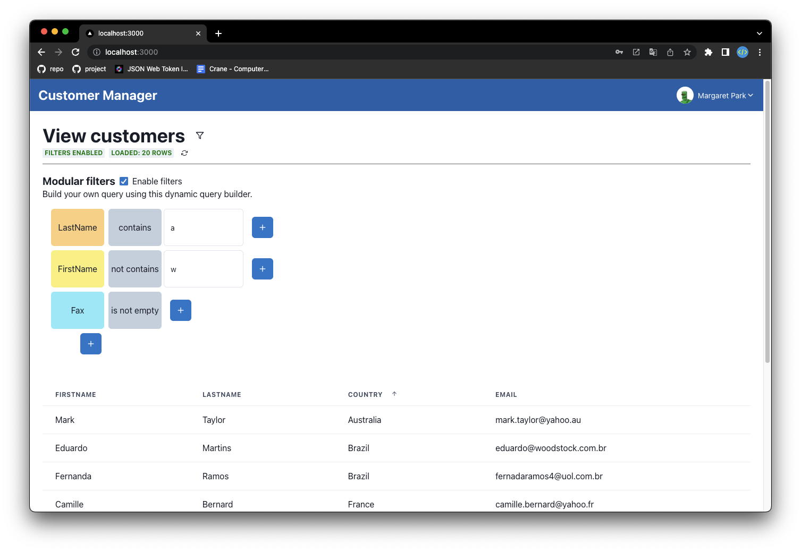
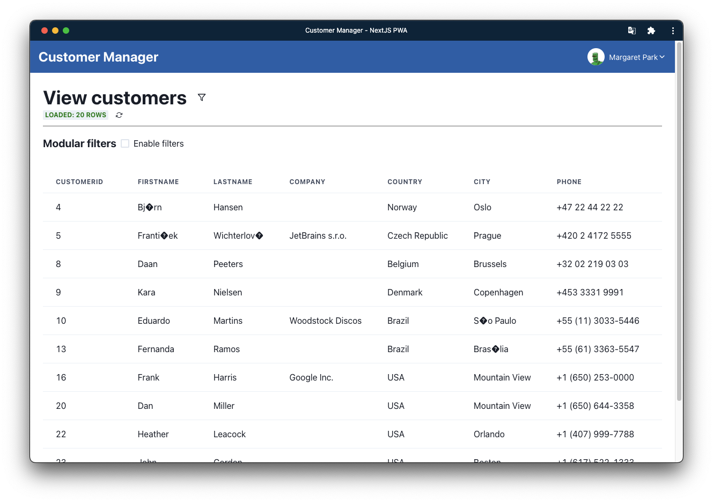
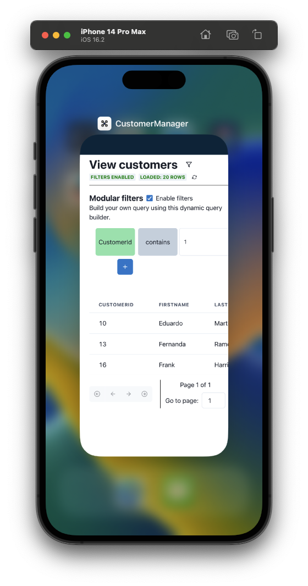
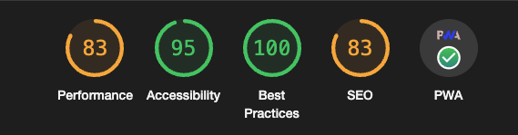
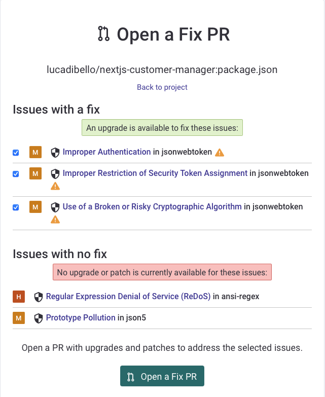

# NextJS Customer Manager

Link al README in inglese: [README.md](./README.md)

Per provare l'applicazione, vai al capitolo [Configurazione automatizzata](#3.2.-configurazione-automatizzata) o [Configurazione manuale](#3.3.-configurazione-manuale).

## 1. Tech Stack

- NextJS v13
- TypeScript
- Progressive Web App (PWA) con [next-pwa](https://github.com/shadowwalker/next-pwa)
- Chakra UI
- React Hook Form
- SWR (stale-while-revalidate)
- Prisma ORM
- [Sentry](https://sentry.io/) error tracking
- React Table v7
- Pino logger (with [pino-pretty](https://github.com/pinojs/pino-pretty))

## 1.1. Screenshot progetto

**Home page**


**Profile page**


## 2. Descrizione del progetto

### 2.1. Features

**Login/Logout**
Ogni Employee può effettuare il login con le proprie credenziali (email e password) e può effettuare il logout. Ogni employee ha di default la password `Jo5hu4!`, la quale può essere cambiata nella pagina di profilo.

**Customer Management**
Ogni Employee può visualizzare la lista dei propri clienti all'interno di una tabella. Questa tabella è paginata, ordinabile, filtrabile e permette all'utente di nascondere / mostrare le colonne che desidera.

È stato sviluppato un sistema di ricerca dati che permette all'utente di creare una query di ricerca personalizzata utilizzando dei blocchi grafici. Questo è un esempio:


Ogni riga rappresenta la query di ricerca di campo, dove è possibile selezionare dapprima il campo da ricercare, poi tutte le conditioni che si desidera applicare al campo (start with, contains, is empty, ...).


Il tutto è stato sviluppato in modo da essere il più intuitivo possibile, in modo che l'utente possa creare query di ricerca personalizzate senza dover necessariamente conoscere la sintassi SQL.

**Idle Timeout**
è stato sviluppato un provider chiamato "IdleProvider" che permette di gestire il timeout di inattività dell'utente. Questo provider è stato utilizzato per mostrare un messaggio di avviso all'utente quando il tempo di inattività è stato raggiunto e per effettuare il logout automaticamente quando il tempo di inattività è stato superato.

**User authentication challenge**
Prima di eseguire operazioni sensibili, come ad esempio il cambio della password, può essere richiesta una verifica on-demand aggiuntiva sull'identità dell'utente tramite un login con username e password.

Questa feature non richiede alcuna modifica alla pagina corrente / componente in quanto è già implementata all'interno dell'intera applicazione tramite un Provider di react chiamato [AuthChallengeProvider](providers/auth/challenge/AuthChallengeProvider.tsx) che wrappa l'intera applicazione per mostrare il dialog di login quando necessario.

Dopo aver effettuato il login, il provider ritorna un codice OTP che dovrà utilizzare l'utente per completare l'operazione richiesta. Il codice deve essere allegato alla richiesta HTTP sensibile, che verrà quindi autorizzata solo se il codice OTP è valido.

Per esempio, quando l'utente vuole cambiare la password:


Dopo aver cliccato su "Change password", il provider mostra il dialog di login:


E, dopo aver effettuato il login ed aver ricevuto il codice OTP, l'utente può cambiare la password. Il codice OTP al momento è ritornato dal server nella risposta HTTP, ma in futuro potrebbe essere inviato tramite email o SMS.

Questo è il flow completo:


### 2.2. Introduzione

Questo progetto è stato basato sul risultato del progetto scorso [NextJS JWT authentication boilerplate](https://github.com/lucadibello/nextjs-jwt-auth-boilerplate), il quale ha riscontrato un interesse da parte di molti utenti utilizzatori di NextJS, React e tecnologie correlate (quasi 50 star su GitHub).

Ho dovuto modificare l'AuthContext e l'API di login in quanto la consegna del progetto richiedeva di utilizzare il database Chinook, un database di esempio per il software di gestione del database Microsoft SQL Server. Il database Chinook contiene informazioni su un negozio di musica, come ad esempio i clienti, gli album, i brani, i generi musicali, i fatturati, ecc...

Ho dovuto eseguire queste modifiche al database Chinook per renderlo compatibile con il boilerplate:

1. Ho aggiunto una colonna "password" alla tabella "Customer" per salvare la password dell'utente.
2. Aggiunto campo "role" alla tabella "Customer" per salvare il ruolo dell'utente (manager, normale).
3. Aggiunto il campo "refresh_token" alla tabella "Customer" per salvare il refresh token dell'utente ed evitare attacchi di tipo [CSRF](https://it.wikipedia.org/wiki/Cross-site_request_forgery).
4. Aggiunto *unique contraint* alla colonna "email" della tabella "Customer" per evitare che un utente possa registrarsi con lo stesso indirizzo email.

Nota: tutte le feature legate alla "two-factor authetication", le quali erano già presenti all'interno del boilerplate, sono state rimosse in quanto non richieste dalla consegna del progetto.

### 2.3. Implementazione tracciabilità errori ed operazioni

Per implementare la tracciabilità necessarie, ho utilizzato una soluzione SaaS chiamata [Sentry](http://sentry.io), uno strumento di tracciamento degli errori in tempo reale che aiuta gli sviluppatori a monitorare e risolvere i crash in tempo reale. Attraverso la dashboard di Sentry, è possibile sia visualizzare tutti gli errori che si verificano nel server (con la possibilità di filtrare gli errori per tipo, data, stack trace, ecc...) sia visualizzare le operazioni svolte dal server (es: login, logout, registrazione, ecc...) e le chiamate API effettuate dal client, mostrando anche informazioni come la frequenza con cui vengono effettuate le chiamate, il tempo di risposta, chi ha effettuato la chiamata, ecc...

Per esempio, questo screenshot mostra le informazioni relative all'API per il fetch dei customers:


Ho anche aggiunto un logger personalizzato per loggare le operazioni svolte nel server, utilizzando il modulo [pino](https://github.com/pinojs/pino) e il suo plugin [pino-pretty](https://github.com/pinojs/pino-pretty) per renderlo più leggibile (di default Pino logga in formato JSON).

### 2.4. Fix problema di sicurezza boilerplate

Ho aggiunto alcune funzionalità al sistema per migliorare la sicurezza, salvando i token JWT in due posti diversi: il **refresh token** all'interno del localStorage (accessibile solo dal client) e l'altro all'interno di un cookie chiamato "*token*" (accessibile sia dal client che dal server in quanto inviato insieme ad ogni richiesta).

Inizialmente il refresh token era salvato all'interno di un cookie chiamato "*refresh-token*", ma ha portato ad alcuni problemi di sicurezza, come ad esempio il fatto che il refresh token è accessibile sia dal client che dal server, quindi se un attaccante fosse riuscito ad accedere al cookie, avrebbe potuto utilizzare il refresh token per ottenere un nuovo access token e accedere alle risorse protette.

### 2.5. Implementazione Progressive Web App

Infine, per dare all'utente un *look and feel* simile a quello che l'utente avrebbe utilizzando una vera applicazione, ho deciso di convertire il progetto in una PWA ([Progressive Web App](https://web.dev/progressive-web-apps/)) per renderlo più simile a un'applicazione nativa rendendola installabile su vari dispositivi del client (Laptop, PC, Table, Smartphone) e, per la maggior parte delle funzionalità, funzionante offline con l'utilizzo di un [service worker](https://web.dev/learn/pwa/service-workers/).
Per farlo, ho utilizzato il modulo next-pwa, un plugin di NextJS che consente di aggiungere facilmente funzionalità PWA alla propria applicazione NextJS. Ho anche generato tutte le icone mascherabili necessarie usando [maskable.app](https://maskable.app/) e ho aggiunto il file manifest.json alla cartella public, sistemando anche il file middleware.ts per consentire all'utente di accedere ai file richiesti anche quando non è loggato (per impostazione predefinita, ogni pagina ha accesso protetto).

Per evitare problemi (ex: richieste HTTP che rispondono con chiamate salvate in cache), il service worker viene disabilitato in modalità sviluppo (quando si utilizza `yarn dev`, controllo eseguito con questa logica: `process.env.NODE_ENV === 'development'`).

L'applicazione è installabile cliccando sul pulsante "Install" presente nella barra di navigazione, come mostrato nella seguente immagine:


Così è come appare l'applicazione installata sul mio PC:



E così è come appare l'applicazione installata su uno smartphone:


Si può vedere che l'applicazione PWA all'utente appare come un'applicazione nativa, con un'icona e un nome personalizzati. Infatti, persino nel app switcher l'applicazione appare come un'applicazione nativa:



**Problema encoding caratteri speciali**: Il problema di codifica è dovuto dal fatto che il mio database PostgreSQL non è stato configurato correttamente con l'encoding UTF-8, quindi quando ho importato i dati nel database, alcuni caratteri speciali (come ad esempio l'apostrofo) sono stati salvati in modo errato.
Ho deciso di non risolvere questo problema in quanto il progetto è solo un esempio per mostrare come si può utilizzare NextJS e TypeScript per creare una PWA sicura, quindi il come i dati sono salvati non è il punto focale del progetto.

### 2.6. Validazione dati lato server

Per la validazione dei dati lato server, ho utilizzato il modulo [yup](https://github.com/jquense/yup), la libreria di validazione di dati più popolare per JavaScript. Ho utilizzato questo modulo per validare sia i dati inviati dal client al server, sia i dati che vengono salvati nel database. Per semplificare il processo di validazione, ho creato un middleware personalizzato ([JoiMiddleware](./middlewares/joi-middleware.ts)) che valida automaticamente i dati inviati in base ad uno schema Joi personalizzato passato come parametro al middleware.

### 2.7. Performance

Ho eseguito un assessment della performance della webapp utilizzando il tool [Lighthouse](https://developers.google.com/web/tools/lighthouse) di Google, che fornisce un report sulle prestazioni, l'accessibilità, la SEO e la migliore pratica per le Progressive Web App.

Questo è il risultato:



Come si può vedere, la webapp ha un ottimo score per quanto riguarda l'accessibilità e le best pratices, mentre per quanto riguarda le prestazioni (ovvero il tempo di caricamento della pagina) e la SEO, il punteggio è un po' più basso, ma comunque accettabile. Questo è dovuto al fatto che lo scopo di questo progetto non è quello di creare una webapp con un ottimo score per quanto riguarda le prestazioni, ma di creare una webapp che rispetti i requisiti richiesti dal progetto utilizzando tecniche state-of-the-art, utilizzate a livello professionale.

## 2.8. Footprint webapp

Questa webapp ha un footprint veramente minimo, questo grazie a tutte le ottimizzazioni eseguite durante il build del progetto (es: code splitting, tree shaking, minificazione, etc...). Questo è il risultato del comando 'yarn build`:

```sh
Route (pages)                              Size     First Load JS
┌ λ /                                      34.9 kB         289 kB
├   /_app                                  0 B             223 kB
├ λ /404                                   6.78 kB         229 kB
├ λ /api/challenge/start                   0 B             223 kB
├ λ /api/change-password                   0 B             223 kB
├ λ /api/customers                         0 B             223 kB
├ λ /api/login                             0 B             223 kB
├ λ /api/me                                0 B             223 kB
├ λ /api/refresh                           0 B             223 kB
├ ○ /login                                 1.4 kB          232 kB
└ ○ /profile                               4.31 kB         259 kB
+ First Load JS shared by all              223 kB
  ├ chunks/framework-ffee79c6390da51e.js   45.7 kB
  ├ chunks/main-972b3d2d3e6e8a7c.js        34.3 kB
  ├ chunks/pages/_app-005bf9e1593bc12d.js  141 kB
  ├ chunks/webpack-f4e692136d6f1094.js     1.48 kB
  └ css/ab44ce7add5c3d11.css               247 B

ƒ Middleware                               29.6 kB

λ  (Server)  server-side renders at runtime (uses getInitialProps or getServerSideProps)
○  (Static)  automatically rendered as static HTML (uses no initial props)
```

NextJS offre molte funzionalità *enterprise level*, infatti è un Framework utilizzato da molti grandi player del settore, come ad esempio: Netflix, Uber, Twitch, etc...

Per avere ulteriori informazioni, questa è la documentazione ufficiale di NextJS, dove spiega del compiler e del build process: <https://nextjs.org/docs/advanced-features/compiler>

### 2.9. Error handling

Oltre ad aver aggiunto Sentry per il tracking degli errori, ho anche aggiunto una pagina di errore personalizzata, che viene mostrata quando si verifica un errore non gestito. Essa viene mostrata in automatico da NextJS quando viene lanciato un errore che non è stato gestito.

Per ulteriori informazioni: <https://nextjs.org/docs/advanced-features/custom-error-page>

### 2.10. Code analysis

Durante tutto il processo di sviluppo della webapp è stato utilizzato [**ESLint**](https://eslint.org) per analizzare ed aiutare a identificare e correggere gli errori di codifica e i problemi di qualità del codice. È altamente personalizzabile e supporta una vasta gamma di plugin per adattarsi a diverse esigenze.

Siccome ESLint non controlla possibili vulnerabilità di sicurezza, ho dovuto utilizzare un tool aggiuntivo per questo scopo. Ne esistono diversi, ma ho scelto [**Snyk**](https://snyk.io) perché è gratuito per progetti open source e perché è molto semplice da utilizzare. Snyk permette di analizzare la codebase e le dipendenze di un progetto, per identificare eventuali vulnerabilità di sicurezza e fornire una soluzione per risolverle. Ho utilizzato l'integrazione di Snyk con GitHub, in modo da poter eseguire un analisi automatica ogni volta che viene effettuato un push su GitHub.

Si può vedere come le uniche vulnerabilità di sicurezza trovate sono relative a pacchetti npm utilizzati nel progetto, mentre non sono state trovate vulnerabilità di sicurezza relative al codice scritto da me:


È possibile vedere più nello specifico quali sono le vulnerabilità di sicurezza trovate, cliccando sul file **package.json**:


Ogni vulnerabilità di sicurezza ha diversi attributi:

- **Severity**: indica la gravità della vulnerabilità
- **Priority**: indica la priorità con cui risolvere la vulnerabilità
- **Fixability**: indica se è possibile risolvere la vulnerabilità con una patch o se è necessario aggiornare il package (fixable, partially fixable, unfixable)
- **Exploit maturity**: indica se la vulnerabilità è stata già sfruttata o meno (mature, proof-of-concept, no-known-exploit)
- **Status**: indica lo stato della vulnerabilità (open, patched, ignored)

In totale sono state trovate 5 vulnerabilità di sicurezza di package npm (1 High severity, 4 Medium severity). Tramite Snyk è possibile creare delle Pull Request automatiche per risolvere le vulnerabilità trovate.
Di queste vulnerabilità, **3 sono Proof-of-Concept e 2 sono No-known-exploit**.

Purtroppo, per le due vulnerabilità con *maturity* a "No-known exploits" non è ancora disponibile una patch:



*Nota: in quanto ho un piano free, non è possibile esportare il report dello scan in formato PDF.*

### 2.11. Risk assessment

#### 2.11.1. Rischi principali

Il sistema è stato progettato per essere sicuro, affidabile e scalabile. In quanto il numero di API è molto limitato e tutte le richieste inoltrate al server vengono dapprima autenticate, autorizzate ed infine validate, la superficie di attacco è molto limitata.
Inoltre, NextJS non ha il concetto di REST API, ma di [Serverless functions](https://vercel.com/docs/concepts/functions/serverless-functions), ovvero funzioni che vengono eseguite in un ambiente isolato e che non hanno accesso al filesystem, quindi non possono essere utilizzate per eseguire attacchi di tipo [Server-Side Request Forgery](https://owasp.org/www-community/attacks/Server_Side_Request_Forgery) oppure di tipo [Code Injection](https://owasp.org/www-community/attacks/Code_Injection).

Attacchi di tipo [SQL Injection](https://www.prisma.io/docs/concepts/components/prisma-client/raw-database-access#sql-injection) non sono possibili, in quanto non vengono utilizzate query SQL direttamente, ma vengono utilizzate le funzionalità di [Prisma ORM](https://www.prisma.io/), che permette di utilizzare query SQL in modo sicuro.

Non sono stati identificati rischi significativi ma possono essere identificati i seguenti rischi che, sebbene in parte non siano direttamente correlati dall'applicazione, possono essere utilizzati per compromettere la sicurezza della webapp:

- **Rischio 1 (ALTO)**: I progetti basati su pacchetti open source sono soggetti a vulnerabilità di sicurezza, che possono essere utilizzate per compromettere la sicurezza dell'applicazione. Per ovviare a questo rischio, ho utilizzato il comando `yarn audit` per verificare se ci sono vulnerabilità di sicurezza nei pacchetti utilizzati. Inoltre, ho aggiunto un GitHub Action che esegue questo comando ad ogni push, in modo da essere sicuri che non ci siano vulnerabilità di sicurezza nei pacchetti utilizzati e, se ci fossero, che vengano risolte in modo tempestivo.

- **Rischio 2 (BASSO)**: Sia gli access token i refresh token sono memorizzati lato client in modo sicuro ma, se un attaccante riuscisse ad avere accesso fisico al client (ex: [Remote Access Trojan](https://www.malwarebytes.com/blog/threats/remote-access-trojan-rat) / [USB RubberDucky](https://shop.hak5.org/products/usb-rubber-ducky)), potrebbe clonare entrambi i token di access permettendo all'attaccante (nel peggiore dei casi) 30 giorni di accesso all'applicazione (la durata di vita del refresh token è di default 30 giorni). Questo rischio è stato classificato come basso, in quanto se un attaccante riuscisse ad avere accesso fisico al client, potrebbe anche installare un keylogger e ottenere le credenziali dell'utente, che potrebbe utilizzare per accedere all'applicazione senza aver bisogno di clonare alcun token.

- **Rischio 3 (MEDIO)**: Manca una protezione contro attacchi di tipo bruteforce. Se un attaccante potrebbe utilizzare un attacco di tipo bruteforce per provare un gran numero di combinazioni di password al fine di ottenere con la forza bruta (*bruteforce*) l'accesso all'account di un determinato utente. Per ovviare a questo rischio, si dovrebbe implementare un sistema di protezione contro gli attacchi di tipo bruteforce, come ad esempio l'utilizzo di un sistema di autenticazione a più fattori, la limitazione del numero di tentativi di accesso non riusciti (come fanno tutti gli smartphone) o la temporizzazione dell'accesso dopo un numero specifico di tentativi falliti.

- **Rischio 4 (MEDIO)**: Gli attacchi DDoS sono attacchi che mirano a saturare il server con richieste in modo da impedire l'accesso ai servizi offerti dal server stesso. Questo potrebbe essere fatto richiamando un gran numero di volte una determinata API, oppure richiamando un gran numero di API diverse. Per ovviare a questo rischio, si dovrebbe implementare un sistema di protezione contro gli attacchi DDoS, come ad esempio l'utilizzo di un sistema di caching, l'utilizzo di un sistema di rate limiting o l'utilizzo di un sistema di protezione DDoS come ad esempio [Cloudflare](https://www.cloudflare.com/).

### 2.12. Privacy

#### 2.12.1. Possibili problemi di privacy

I token JWT assegnati all'utente contengono informazioni sensibili, come ad esempio l'ID dell'utente, il nome dell'utente, l'indirizzo email dell'utente e il ruolo dell'utente. Queste informazioni possono essere utilizzate per identificare l'utente in modo univoco.

Questo potrebbe essere un problema di privacy, in quanto l'utente potrebbe non voler che queste informazioni siano conosciute da terzi. Questi dati potrebbero essere anche utilizzati come vettore di attacco (ex: Social Engineering attraverso indirizzo E-Mail, Bruteforce, etc.).

Questo problema potrebbe essere mitagato criptando il payload del token JWT, in modo da rendere impossibile la lettura del payload senza la chiave di decrittazione. Oppure utilizzando altri metodi di autenticazione come [IronSession](https://github.com/vvo/iron-session) (utilizza cookie cifrati per memorizzare le informazioni di sessione) oppure [OAuth](https://curity.io/resources/learn/privacy-and-gdpr/) (utilizza un token di accesso cifrato per memorizzare le informazioni di sessione).

#### 2.12.2. Informazioni sensibili memorizzate nel database

All'interno del database sono memorizzate diverse informazioni sensibili, sia degli *Employee* che dei relativi *Customers* (il database comprende molte più tabelle, però per questo progetto vengono tenute in considerazione solo queste due).

Questi dati (tranne la password associata ad ogni *Employee* per accedere al sistema) sono memorizzati in chiaro nel database, in quanto non è stato implementato alcun sistema di protezione di queste informazioni.

In particolare, sono memorizzati in chiaro i seguenti dati sensibili:

- Nome, Cognome
- Indirizzo E-Mail
- Indirizzo di residenza
- Azienda di appartenenza (Solo per *Customers*)
- Numeri di telefono
- Data di nascita e data di assunzione (Solo per *Employees*)

In caso di data breach, le informazioni sensibili memorizzate nel database potrebbero essere esposte e utilizzate da terze parti per fini illeciti, come ad esempio il furto di identità, utilizzati per phishing, frodi finanziarie, atti di estorsione o anche stalking.

Per prevenire questo tipo di fuga di dati, è possibile utilizzare tecniche di crittografia per proteggere le informazioni sensibili, in modo che non siano leggibili in chiaro nel database. Questo va affiancato a meccanismi di autenticazione a più fattori per garantire che solo utenti autorizzati abbiano accesso al database. Inoltre, è importante che i dati sensibili non siano memorizzati in modo permanente nel database, ma vengano eliminati o resi illeggibili non appena non sono più necessari.

Un esempio recente è il data breach subito da Marriott International nel 2018, in cui informazioni personali di oltre 500 milioni di clienti, tra cui numeri di passaporto e indirizzi di residenza, sono state rubate. Un altro esempio è il data breach subito da Yahoo nel 2013, in cui informazioni personali di oltre 3 miliardi di utenti, tra cui password e indirizzi email, sono state rubate.

È importante tenere presente che anche se si adottano tutte le misure di sicurezza necessarie, non si può mai essere completamente al sicuro da un data breach. Pertanto, è importante avere piani di emergenza in atto per gestire rapidamente e adeguatamente una violazione della sicurezza quando si verifica.

#### 2.12.3. Classificazione informazioni sensibili

Le informazioni sensibili salvate in chiaro nel database possono essere classificate in base alle necessità di trattamento come segue:

- **Informazioni di identificazione personale:** Nome, Cognome, Indirizzo E-Mail, Indirizzo di residenza, Data di nascita (solo per employees). Queste informazioni sono essenziali per identificare una persona e possono essere utilizzate per l'accesso al sistema o per l'invio di informazioni importanti.

- **Informazioni di contatto:** Numero di telefono. Queste informazioni sono utilizzate per contattare le persone per questioni relative al loro account o al loro ordine.
  
- **Informazioni aziendali:** Azienda di appartenenza (solo per i clienti). Queste informazioni possono essere utilizzate per personalizzare l'esperienza utente o per inviare offerte speciali.

### 2.12.4. Possibili accorgimenti per ridurre il rischio

Per migliorare il sistema e renderlo più resiliente a problemi di data breach, si possono adottare le seguenti misure:

**Crittografare le informazioni sensibili:** Utilizzare un algoritmo di crittografia a chiave simmetrica o asimmetrica per criptare le informazioni sensibili, come i numeri di telefono e gli indirizzi e-mail.

**Utilizzare un sistema di autenticazione a più fattori:** Utilizzare una combinazione di metodi di autenticazione, come la password e la verifica tramite SMS o e-mail, per proteggere l'accesso al sistema.
Limitare l'accesso alle informazioni sensibili: Limitare l'accesso alle informazioni sensibili solo a coloro che ne hanno necessità per svolgere le loro funzioni.

**Utilizzare un firewall:** Utilizzare un firewall per proteggere il sistema dalle minacce esterne.

**Utilizzare un sistema di monitoraggio:** Utilizzare un sistema di monitoraggio per tenere traccia degli accessi al sistema e delle modifiche apportate alle informazioni sensibili.

**Fare una revisione regolare dei permessi:** Fare una revisione regolare dei permessi per garantire che solo gli utenti autorizzati abbiano accesso alle informazioni sensibili.

**Fare backup regolari:** Fare backup regolari delle informazioni sensibili per poterle ripristinare in caso di data breach.

**Utilizzare un sistema di gestione degli incidenti:** Utilizzare un sistema di gestione degli incidenti per monitorare e gestire gli incidenti di sicurezza, come la perdita di dati sensibili.

## 3. Getting Started

### 3.1 Prerequisiti

- Node.js v14.17.0 or superiore
- Yarn v1.22.10 or superiore
- PostgreSQL v13.3 or superiore

### 3.2. Configurazione automatizzata

Avviso: Questa configurazione utilizza Docker e Docker Compose per creare un contenitore PostgreSQL ed eseguire l'applicazione.

#### 3.2.1. Installare Docker e Docker Compose

- [Docker](https://docs.docker.com/get-docker/)
- [Docker Compose](https://docs.docker.com/compose/install/)

#### 3.2.2. Eseguire e creare il database

Questo script creerà sia il contenitore dell'applicazione Next.js sia il contenitore PostgreSQL, oltre a creare il database con i dati contenuti nel file `prisma/sql/chinook-postgre.sql`.

```sh
bash ./fresh-dockerized-start.sh
```

Tradotto con www.DeepL.com/Translator (versione gratuita)

### 3.3. Configurazione manuale

#### 3.3.1. Installare pacchetti Node.js

```sh
yarn install
```

Oppure, se si utilizza `npm`:

```sh
npm install
```

#### 3.3.2. (Opzionale) Creare un nuovo container Docker per PostgreSQL
  
```sh
docker run --name nextjs-customer-auth -e POSTGRES_PASSWORD=postgres -p 5432:5432 -d postgres
```

#### 3.3.3. Rinominare file `.env.example`  in `.env` e modificare le variabili d'ambiente

```sh
cp .env.example .env
```

#### 3.3.4. Push schema database e seeding aggiuntivo
  
```sh
yarn prisma db push
```

### 3.3.5. Seeding manuale del database

Dato che il lo script di seeding è enorme (15631 inserimenti) ed è difficile gestirlo attraverso Prisma ho preferito utilizzare il comando `psql` offerto da PostgreSQL (molto più performante).

Per eseguire il seeding senza preoccupazioni / problemi all'interno del container Docker creato al punto **3.2.2**, ho creato uno script bash che automatizza il processo. Per eseguirlo, basta eseguire il seguente comando:

```sh
bash ./prisma/sql/import-toolkit.sh nextjs-customer-auth ./prisma/sql/chinook-postgres.sql
```

#### 3.3.6. Start the development server

```sh
yarn dev
```

## 4. Domande database

**Installate il database nel formato preferito e date un'occhiata ai dati delle entità Cliente e Dipendente: quanti record contengono?**

Query per ottenere il numero di Employee:

```sql
/* COUNT HOW MANY EMPLOYEES ARE IN THE DATABASE */
SELECT COUNT(*) FROM "Employee";
```

Query per ottenere il numero di Clienti:

```sql
/* COUNT HOW MANY CUSTOMERS ARE IN THE DATABASE */
SELECT COUNT(*) FROM "Customer";
```

Eseguendo le query riportate sopra, si ottiene che il database contiene solo 8 dipendenti e 59 clienti.

**Quale dipendente ha il maggior numero di clienti?**

Query per ottenere il dipendente con il maggior numero di clienti:

```sql
/* CHECK WHOSE EMPLOYEE HAS THE MOST CUSTOMERS (CONCAT FirstName and LastName) */
SELECT CONCAT(e."FirstName", ' ', e."LastName") AS "Employee Name", COUNT("CustomerId") AS "Number of Customers"
FROM "Employee" e INNER JOIN "Customer" c
    ON e."EmployeeId" = c."SupportRepId"
    GROUP BY e."EmployeeId"
    ORDER BY "Number of Customers" DESC
    LIMIT 1;
```

Eseguendo la query, si ottiene che il dipendente con il maggior numero di clienti è "*Jane Peacock*".

**Quale cliente ha il maggior numero di fatture (Invoice)?**


Query per ottenere il cliente con il maggior numero di fatture:

```sql
/* CHECK WHOSE CUSTOMER HAS THE MOST INVOICES (CONCAT FirstName and LastName) */
SELECT CONCAT(c."FirstName", ' ', c."LastName") AS "Customer Name", COUNT("InvoiceId") AS "Number of Invoices"
FROM "Customer" c INNER JOIN "Invoice" i
    ON c."CustomerId" = i."CustomerId"
    GROUP BY c."CustomerId"
    ORDER BY "Number of Invoices" DESC
    LIMIT 1;
```

Con la seguente query risulta che il cliente con il maggior numero di fatture (*invoices*) è "*Robert Brown*", con un totale di 7 fatture.

Questo non è essattamente il risultato corretto in quanto l'ultima istruzione "LIMIT 1" seleziona solo il primo record, ovvero il cliente con il maggior numero di fatture. Molti clienti hanno lo stesso numero di fatture, quindi per ottenere il risultato corretto, è necessario rimuovere l'ultima istruzione "LIMIT 1". Output:

```csv
Camille Bernard,7
Hannah Schneider,7
Martha Silk,7
Enrique Muoz,7
Mark Philips,7
Heather Leacock,7
Robert Brown,7
Fernanda Ramos,7
Leonie Köhler,7
Frank Harris,7
Alexandre Rocha,7

<TRONCATO>
```
