# NextJS Customer Manager

## 0. Tech Stack

- NextJS v13
- TypeScript
- Chakra UI
- React Hook Form
- SWR (stale-while-revalidate)
- Prisma ORM
- [Sentry](https://sentry.io/) error tracking
- React Table v7
- Pino logger (with [pino-pretty](https://github.com/pinojs/pino-pretty))

## 0.1. Project screenshots

**Home page**
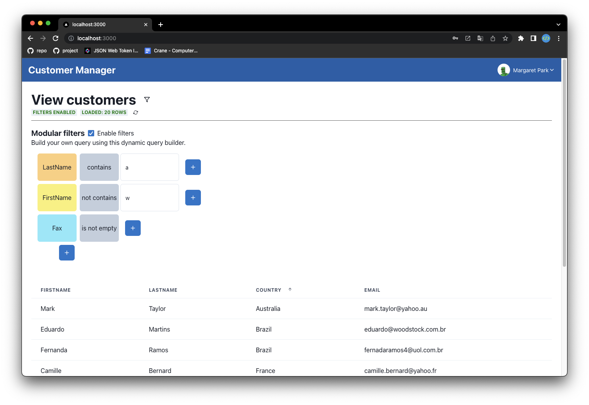

**Profile page**
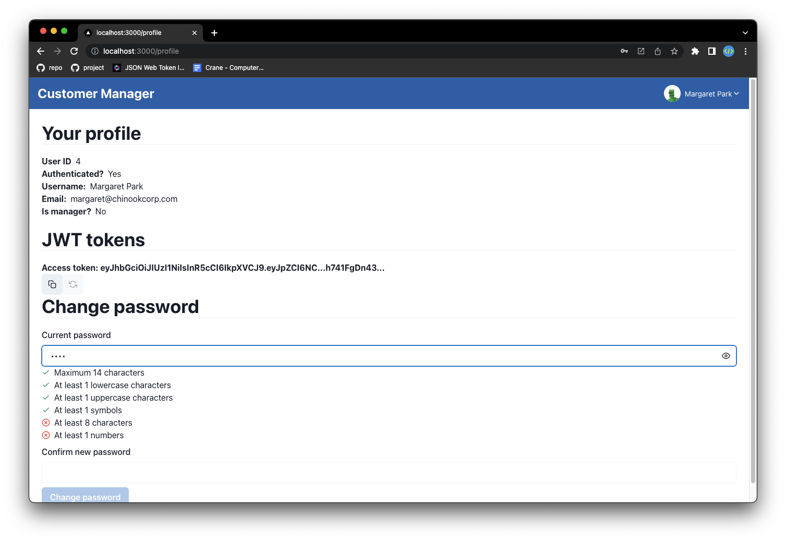

## 1. Project description

### 1.0. Features

**Login/Logout**
Each Employee can log in with his/her credentials (email and password) and can log out. Each employee has the default password `Jo5hu4!`, which can be changed on the profile page.

**Customer Management**
Each Employee can view the list of their customers within a table. This table is paged, sortable, filterable, and allows the user to hide/show the columns they want.

A data search system has been developed that allows the user to create a custom search query using graphical blocks. This is an example:

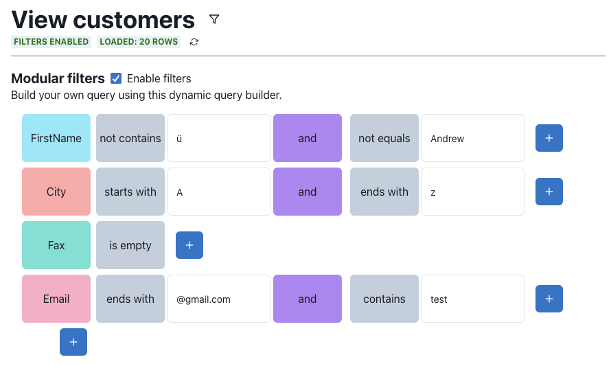

Each row represents the field search query, where you can first select the field to search, then all the conditions you want to apply to the field (start with, contains, is empty, ...).

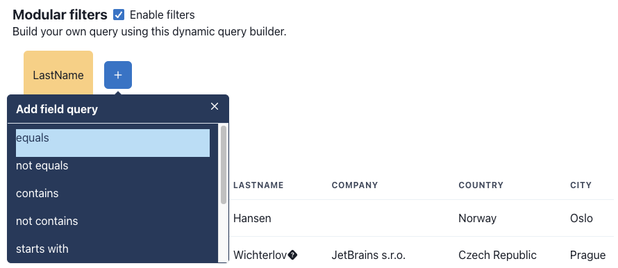

This has been developed to be as intuitive as possible, so that the user can create custom search queries without necessarily having to know SQL syntax.

**Idle Timeout**
a provider called "IdleProvider" was developed to manage the user's idle timeout. This provider was used to show a warning message to the user when the idle timeout was reached and to log out automatically when the idle timeout was exceeded.

### 1.1. Introduction

This project was based on the result of the last project [NextJS JWT authentication boilerplate](https://github.com/lucadibello/nextjs-jwt-auth-boilerplate), which found interest from many users of NextJS, React, and related technologies (nearly 50 stars on GitHub).

I had to modify the AuthContext and login API because the project delivery required using the Chinook database, a sample database for Microsoft SQL Server database management software. The Chinook database contains information about a music store, such as customers, albums, songs, music genres, turnovers, etc....

I had to make these changes to the Chinook database to make it compatible with boilerplate:

1. I added a "password" column to the "Customer" table to store the user's password.
2. Added "role" field to the "Customer" table to save the user's role (manager, normal).
3. Added "refresh_token" field to the "Customer" table to save the user's refresh token and avoid [CSRF](https://it.wikipedia.org/wiki/Cross-site_request_forgery) type attacks.
4. Added *unique contraint* to the "email" column of the "Customer" table to prevent a user from registering with the same email address.

Note: All features related to "two-factor authetication," which were already present within the boilerplate, have been removed as not required by the project delivery.

Note: All features related to "two-factor authetication," which were already present within the boilerplate, have been removed as not required by the project delivery.

### 1.2. Implementazione tracciabilità errori ed operazioni

To implement the necessary traceability, I used a SaaS solution called [Sentry](http://sentry.io), a real-time error tracking tool that helps developers monitor and resolve crashes in real time. Through Sentry's dashboard, it is possible to both view all the errors occurring in the server (with the ability to filter errors by type, date, stack trace, etc...) and to view the operations performed by the server (e.g., login, logout, registration, etc...) and the API calls made by the client, also showing information such as how often the calls are made, response time, who made the call, etc...

For example, this screenshot shows information about the customers fetch API:

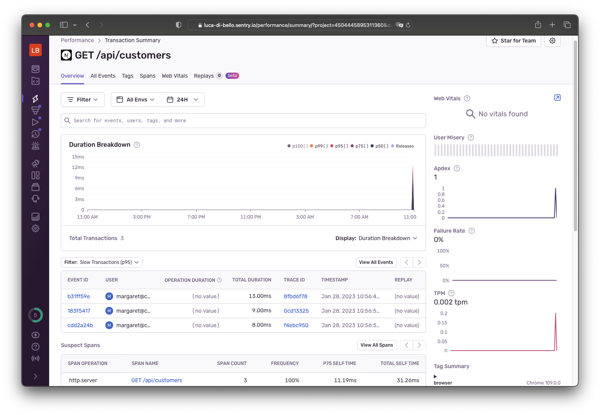

I also added a custom logger to log the operations performed in the server, using the [pino](https://github.com/pinojs/pino) module and its plugin [pino-pretty](https://github.com/pinojs/pino-pretty) to make it more readable (by default Pino logs in JSON format).

### 1.3. Fixes on boilerplate repository

I added some features to the system to improve security by saving the JWT tokens in two different places: the **refresh token** inside the localStorage (accessible only by the client) and the other inside a cookie called "*token*" (accessible by both the client and the server as it is sent along with each request).

Initially, the refresh token was stored within a cookie called "*refresh-token*," but it led to some security problems, such as the fact that the refresh token is accessible by both the client and the server, so if an attacker managed to access the cookie, he could use the refresh token to obtain a new access token and access protected resources.

### 1.4. Progressive Web App implementation

Finally, in order to give the user a *look and feel* similar to what the user would have using a real application, I decided to convert the project to a PWA ([Progressive Web App](https://web.dev/progressive-web-apps/)) to make it more like a native application by making it installable on various client devices (Laptop, PC, Table, Smartphone) and, for most functionality, running offline with the use of a [service worker](https://web.dev/learn/pwa/service-workers/).
To do this, I used the next-pwa module, a NextJS plugin that allows you to easily add PWA functionality to your NextJS application. I also generated all the necessary maskable icons using [maskable.app](https://maskable.app/) and added the manifest.json file to the public folder, also fixing the middleware.ts file to allow the user to access the required files even when not logged in (by default, each page has protected access).

To avoid problems (ex: HTTP requests responding with cached calls), the service worker is disabled in development mode (when using `yarn dev`, control run with this logic: `process.env.NODE_ENV === 'development'`).

The application can be installed by clicking the "Install" button in the navigation bar, as shown in the following image:

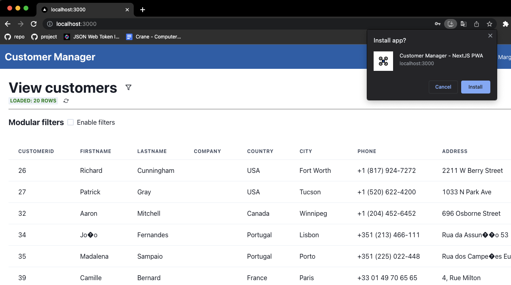

This is what the installed application looks like on my PC:

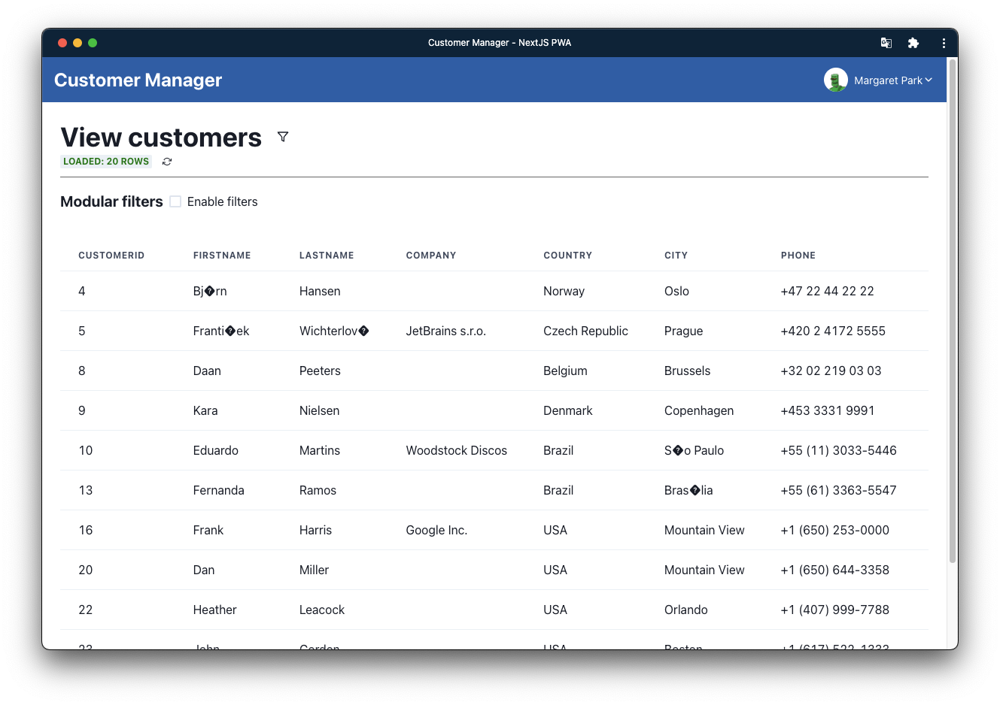

And this is what the application installed on a smartphone looks like:


You can see that the PWA application to the user appears as a native application, with a custom icon and name. In fact, even in the app switcher the application appears as a native application:

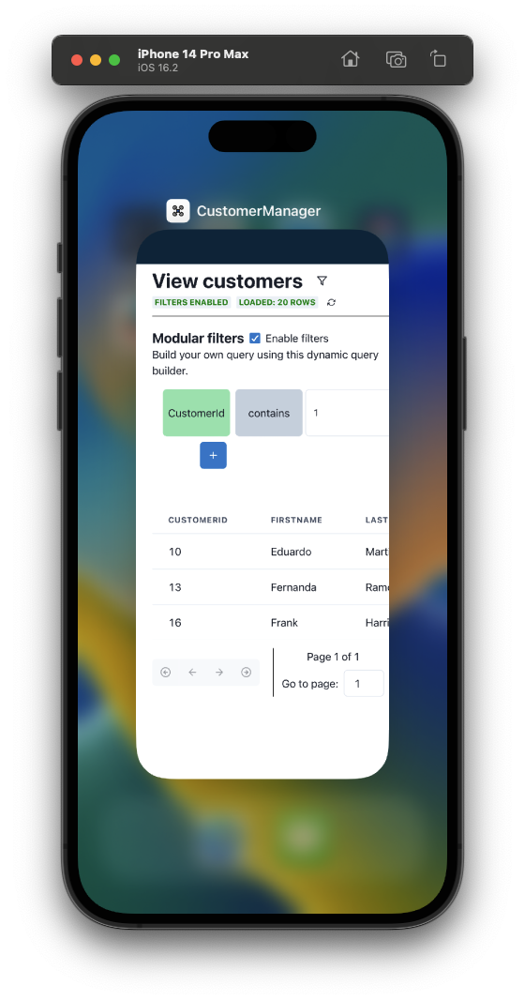

**Special character encoding problem**: The encoding problem is due to the fact that my PostgreSQL database was not configured correctly with UTF-8 encoding, so when I imported the data into the database, some special characters (such as apostrophe) were saved incorrectly.
I decided not to fix this problem since the project is just an example to show how NextJS and TypeScript can be used to create a secure PWA, so how the data is saved is not the focus of the project.

### 1.5 Server-side data validation

For server-side data validation, I used the [yup](https://github.com/jquense/yup) module, the most popular data validation library for JavaScript. I used this module to validate both data sent from the client to the server and data that is saved in the database.

### 1.6. Performance

I performed a webapp performance assessment using Google's [Lighthouse](https://developers.google.com/web/tools/lighthouse) tool, which provides a report on performance, accessibility, SEO, and best practice for Progressive Web Apps.

This is the result:

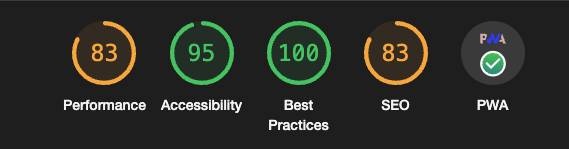

As you can see, the webapp has a very good score for accessibility and best practices, while for performance (i.e., page load time) and SEO, the score is a bit lower, but still acceptable. This is due to the fact that the purpose of this project is not to create a webapp with an excellent score regarding performance, but to create a webapp that meets the requirements of the project using state-of-the-art techniques, used at a professional level.

## 1.7. Footprint webapp

This webapp has a really minimal footprint, this is thanks to all the optimizations performed during the project build (ex: code splitting, tree shaking, minification, etc...). This is the result of the 'yarn build` command:

```sh
Route (pages)                              Size     First Load JS
┌ λ /                                      34.9 kB         289 kB
├   /_app                                  0 B             223 kB
├ λ /404                                   6.78 kB         229 kB
├ λ /api/challenge/start                   0 B             223 kB
├ λ /api/change-password                   0 B             223 kB
├ λ /api/customers                         0 B             223 kB
├ λ /api/login                             0 B             223 kB
├ λ /api/me                                0 B             223 kB
├ λ /api/refresh                           0 B             223 kB
├ ○ /login                                 1.4 kB          232 kB
└ ○ /profile                               4.31 kB         259 kB
+ First Load JS shared by all              223 kB
  ├ chunks/framework-ffee79c6390da51e.js   45.7 kB
  ├ chunks/main-972b3d2d3e6e8a7c.js        34.3 kB
  ├ chunks/pages/_app-005bf9e1593bc12d.js  141 kB
  ├ chunks/webpack-f4e692136d6f1094.js     1.48 kB
  └ css/ab44ce7add5c3d11.css               247 B

ƒ Middleware                               29.6 kB

λ  (Server)  server-side renders at runtime (uses getInitialProps or getServerSideProps)
○  (Static)  automatically rendered as static HTML (uses no initial props)
```

NextJS offers many *enterprise level* features, in fact it is a Framework used by many large players in the industry, such as: Netflix, Uber, Twitch, etc.

To get more information, this is the official documentation of NextJS, where it explains about the compiler and build process: <https://nextjs.org/docs/advanced-features/compiler>

### 1.8. Error handling

In addition to adding Sentry for error tracking, I also added a custom error page, which is shown when an unhandled error occurs. It is automatically shown by NextJS when an error is thrown that has not been handled.

For more information: <https://nextjs.org/docs/advanced-features/custom-error-page>

### 1.9. Code analysis

Throughout the webapp development process, [**ESLint**](https://eslint.org) was used to analyze and help identify and correct coding errors and code quality issues. It is highly customizable and supports a wide range of plugins to fit different needs.

Since ESLint does not check for possible security vulnerabilities, I had to use an additional tool for this purpose. There are several, but I chose [**Snyk**](https://snyk.io) because it is free for open source projects and because it is very easy to use. Snyk allows you to analyze the codebase and dependencies of a project to identify any security vulnerabilities and provide a solution to fix them. I used Snyk's integration with GitHub so that an automatic analysis can be performed whenever a push is made to GitHub.

You can see how the only security vulnerabilities found are related to npm packages used in the project, while no security vulnerabilities were found related to code written by me:

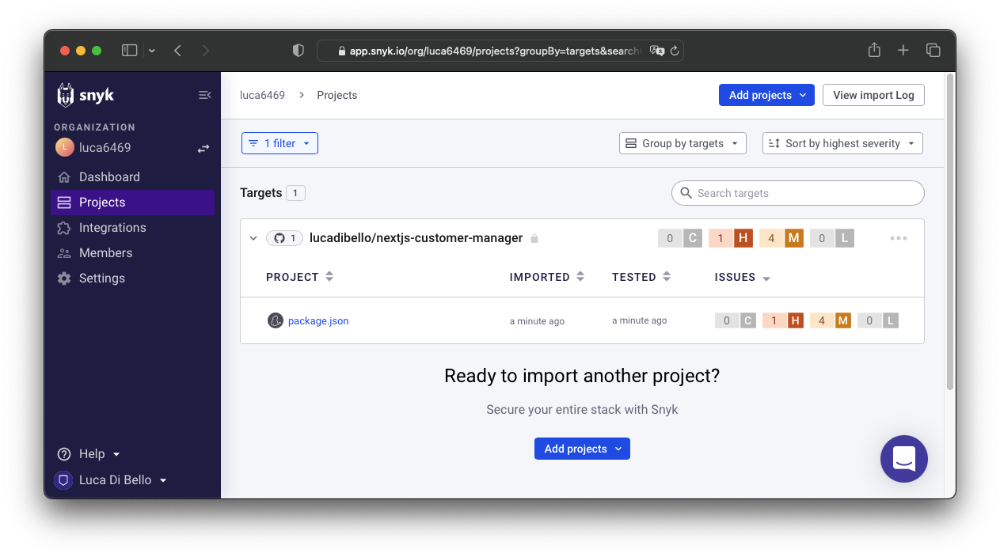

You can see more specifically what security vulnerabilities were found by clicking on the **package.json** file:

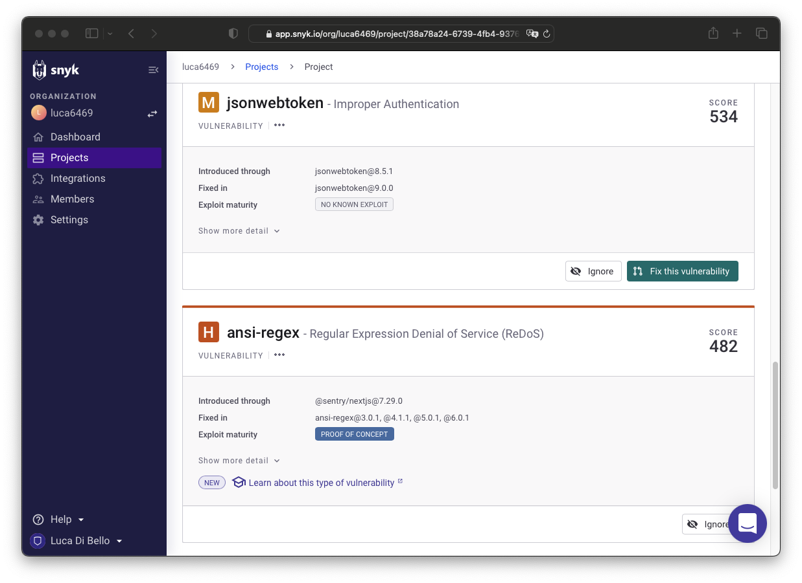

Each security vulnerability has several attributes:

- **Severity**: indicates the severity of the vulnerability.
- **Priority**: indicates the priority with which to fix the vulnerability
- **Fixability**: indicates whether the vulnerability can be fixed with a patch or whether the package needs to be updated (fixable, partially fixable, unfixable)
- **Exploit maturity**: indicates whether the vulnerability has already been exploited or not (mature, proof-of-concept, no-known-exploit)
- **Status**: indicates the status of the vulnerability (open, patched, ignored)

A total of 5 npm package security vulnerabilities were found (1 High severity, 4 Medium severity). Through Snyk, automatic Pull Requests can be created to resolve the found vulnerabilities.
Of these vulnerabilities, **3 are Proof-of-Concept and 2 are No-known-exploit**.

Unfortunately, for the two vulnerabilities with *maturity* to "No-known exploits" there is no patch available yet:

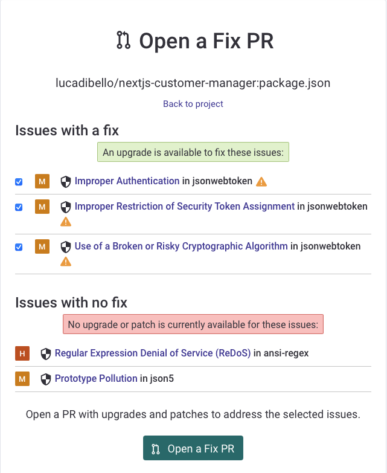

*Note: As I have a free plan, it is not possible to export the scan report in PDF format.*.

### 1.10. Risk assessment

#### 1.10.1. Major risks

The system is designed to be secure, reliable, and scalable. As the number of APIs is very limited and all requests forwarded to the server are first authenticated, authorized and finally validated, the attack surface is very limited.
In addition, NextJS does not have the concept of REST APIs, but of [Serverless functions](https://vercel.com/docs/concepts/functions/serverless-functions), i.e., functions that run in an isolated environment and do not have access to the filesystem, so they cannot be used to perform [Server-Side Request Forgery](https://owasp.org/www-community/attacks/Server_Side_Request_Forgery) or [Code Injection](https://owasp.org/www-community/attacks/Code_Injection) type attacks.

Attacks of the type [SQL Injection](https://www.prisma.io/docs/concepts/components/prisma-client/raw-database-access#sql-injection) are not possible, as SQL queries are not used directly, but the capabilities of [Prism ORM](https://www.prisma.io/) are used, which allows SQL queries to be used securely.

No significant risks have been identified, but the following risks can be identified that, although partly not directly related by the application, can be used to compromise the security of the webapp:

- **Risk 1 (HIGH)**: Projects based on open source packages are subject to security vulnerabilities, which can be used to compromise the security of the application. To address this risk, I used the `yarn audit` command to check for security vulnerabilities in the packages used. In addition, I added a GitHub Action that runs this command on every push, so that we can be sure that there are no security vulnerabilities in the packages used and, if there are, that they are fixed in a timely manner.

- **Risk 2 (LOW)**: Both access tokens and refresh tokens are securely stored client-side but, if an attacker were able to gain physical access to the client (ex: [Remote Access Trojan](https://www.malwarebytes.com/blog/threats/remote-access-trojan-rat) / [USB RubberDucky](https://shop.hak5.org/products/usb-rubber-ducky)), they could clone both access tokens allowing the attacker (worst case) 30 days of access to the application (the lifespan of the refresh token is 30 days by default). This risk was classified as low because if an attacker could gain physical access to the client, they could also install a keylogger and obtain the user's credentials, which they could use to access the application without needing to clone any tokens.

- **Risk 3 (MEDIUM)**: There is a lack of protection against bruteforce attacks. If an attacker could use a bruteforce attack to try a large number of password combinations in order to brute force (*bruteforce*) gain access to a particular user's account. To address this risk, a system should be implemented to protect against bruteforce attacks, such as using a multi-factor authentication system, limiting the number of failed login attempts (as all smartphones do), or timing access after a specific number of failed attempts.

- **Risk 4 (MEDIUM)**: DDoS attacks are attacks that aim to saturate the server with requests so as to prevent access to the services offered by the server. This could be done by calling a specific API a large number of times, or by calling a large number of different APIs. To remedy this risk, a protection system against DDoS attacks should be implemented, such as using a caching system, using a rate limiting system, or using a DDoS protection system such as [Cloudflare](https://www.cloudflare.com/).

### 1.11. Privacy.

#### 1.11.1. Possible privacy issues

JWT tokens assigned to the user contain sensitive information, such as the user's ID, the user's name, the user's email address, and the user's role. This information can be used to uniquely identify the user.

This could be a privacy issue, as the user may not want this information to be known by third parties. This data could also be used as an attack vector (ex: Social Engineering through E-Mail address, Bruteforce, etc.).

This problem could be mitagated by encrypting the payload of the JWT token, so that it is impossible to read the payload without the decryption key. Or by using other authentication methods such as [IronSession](https://github.com/vvo/iron-session) (uses encrypted cookies to store session information) or [OAuth](https://curity.io/resources/learn/privacy-and-gdpr/) (uses an encrypted access token to store session information).

#### 1.11.2. Sensitive information stored in the database

Various sensitive information is stored within the database, both of the *Employees* and their *Customers* (the database includes many more tables, however, for this project only these two are taken into account).

This data (except for the password associated with each *Employee* to access the system) is stored in plaintext in the database, as no system has been implemented to protect this information.

In particular, the following sensitive data are stored in plaintext:

- First Name, Last Name
- E-Mail Address
- Address of residence
- Company affiliation (Only for *Customers*)
- Phone numbers
- Date of birth and date of employment (Only for *Employees*)

In the event of a data breach, sensitive information stored in the database could be exposed and used by third parties for illicit purposes, such as identity theft, used for phishing, financial fraud, acts of extortion, or even stalking.

To prevent this type of data leakage, encryption techniques can be used to protect sensitive information so that it cannot be read in plain text in the database. This should be coupled with multi-factor authentication mechanisms to ensure that only authorized users have access to the database. In addition, it is important that sensitive data are not stored permanently in the database, but are deleted or made unreadable as soon as they are no longer needed.

A recent example is the data breach suffered by Marriott International in 2018, in which personal information of more than 500 million customers, including passport numbers and residential addresses, was stolen. Another example is the data breach suffered by Yahoo in 2013, in which personal information of more than 3 billion users, including passwords and email addresses, was stolen.

It is important to keep in mind that even if you take all the necessary security measures, you can never be completely safe from a data breach. Therefore, it is important to have contingency plans in place to quickly and adequately handle a security breach when it occurs.

#### 1.11.3 Classification of sensitive information

Sensitive information stored in plain text in the database can be classified according to processing needs as follows:

- **Personal identification information:** First name, Last name, E-Mail address, Residential address, Date of birth (for employees only). This information is essential to identify an individual and may be used to access the system or to send important information.

- **Contact information:** Phone number. This information is used to contact people for issues related to their account or order.
  
- **Company information:** Company affiliation (for customers only). This information may be used to personalize the user experience or to send special offers.

### 1.12.4. Possible steps to reduce risk

To improve the system and make it more resilient to data breach issues, the following steps can be taken:

**Encrypt sensitive information:** Use a symmetric or asymmetric key encryption algorithm to encrypt sensitive information, such as phone numbers and e-mail addresses.

**Use a multi-factor authentication system:** Use a combination of authentication methods, such as password and SMS or e-mail verification, to protect access to the system.
Restrict access to sensitive information:Restrict access to sensitive information only to those who need it to perform their functions.

**Use a firewall:** Use a firewall to protect the system from external threats.

**Use a monitoring system:** Use a monitoring system to keep track of system access and changes to sensitive information.

**Make regular review of permissions:** Make regular review of permissions to ensure that only authorized users have access to sensitive information.

**Make regular backups:** Make regular backups of sensitive information so that it can be restored in the event of a data breach.

**Use an incident management system:** Use an incident management system to monitor and manage security incidents, such as the loss of sensitive data.

## 3. Getting Started

### 3.1 Prerequisites

- Node.js v14.17.0 or higher
- Yarn v1.22.10 or higher
- PostgreSQL v13.3 or higher

### 3.2 Configuration

#### 3.2.1 Installing Node.js packages

```sh
yarn install
```

Or, if using `npm`:

```sh
npm install
```

#### 3.2.2. (Optional) Create a new Docker container for PostgreSQL
  
```sh
docker run --name nextjs-customer-auth -e POSTGRES_PASSWORD=postgres -p 5432:5432 -d postgres
```

#### 3.2.3. Rename file `.env.example` to `.env` and change environment variables

```sh
cp .env.example .env
```

#### 3.2.4. Push database schema and additional seeding
  
```sh
yarn prism db push
```

### 3.2.5. Manual seeding of the database

Since the seeding script is huge (15631 entries) and it is difficult to manage it through Prism I preferred to use the `psql` command offered by PostgreSQL (much more performant).

To perform the seeding without worries / problems inside the Docker container created in **3.2.2**, I created a bash script that automates the process. To run it, simply execute the following command:

```sh
bash ./prisma/sql/import-toolkit.sh nextjs-customer-auth ./prisma/sql/chinook-postgres.sql
```

#### 3.2.5. Start the development server

```sh
yarn dev
```

## 4. Database Questions

**Install the database in the preferred format and take a look at the data of the Customer and Employee entities: how many records do they contain?**

Query to get the number of Employee:

```sql
/* COUNT HOW MANY EMPLOYEES ARE IN THE DATABASE */
SELECT COUNT(*) FROM "Employee";
```

Query to obtain the number of Clients:

```sql
/* COUNT HOW MANY CUSTOMERS ARE IN THE DATABASE */
SELECT COUNT(*) FROM "Customer";
```

Running the queries above results in the database containing only 8 employees and 59 customers.

**Which employee has the most customers?

Query to obtain the employee with the most customers:

```sql
/* CHECK WHOSE EMPLOYEE HAS THE MOST CUSTOMERS (CONCAT FirstName and LastName) */
SELECT CONCAT(e."FirstName", ' ', e."LastName") AS "Employee Name", COUNT("CustomerId") AS "Number of Customers"
FROM "Employee" e INNER JOIN "Customer" c
    ON e."EmployeeId" = c."SupportRepId"
    GROUP BY e."EmployeeId"
    ORDER BY "Number of Customers" DESC
    LIMIT 1;
```

Running the query, we get that the employee with the most customers is "*Jane Peacock*".

**Which customer has the most invoices (Invoice)?**


Query to get the customer with the most invoices:

```sql
/* CHECK WHOSE CUSTOMER HAS THE MOST INVOICES (CONCAT FirstName and LastName) */
SELECT CONCAT(c."FirstName", ' ', c."LastName") AS "Customer Name", COUNT("InvoiceId") AS "Number of Invoices"
FROM "Customer" c INNER JOIN "Invoice" i
    ON c."CustomerId" = i."CustomerId"
    GROUP BY c."CustomerId"
    ORDER BY "Number of Invoices" DESC
    LIMIT 1;
```

The following query shows that the customer with the most invoices (*invoices*) is "*Robert Brown*", with a total of 7 invoices.

This is not exactly the correct result since the last statement "LIMIT 1" selects only the first record, which is the customer with the most invoices. Many customers have the same number of invoices, so to get the correct result, the last instruction "LIMIT 1" must be removed. Output:

```csv
Camille Bernard,7
Hannah Schneider,7
Martha Silk,7
Enrique Muoz,7
Mark Philips,7
Heather Leacock,7
Robert Brown,7
Fernanda Ramos,7
Leonie Köhler,7
Frank Harris,7
Alexandre Rocha,7

<TRUCATED>
```